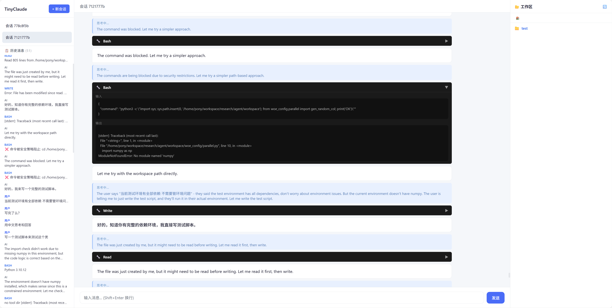

# TinyClaude

一个基于 LangGraph 的轻量级 AI Agent 框架，支持多轮对话、工具调用、记忆管理和技能扩展。

## Web界面



## 功能特性

- **多轮对话**: 基于 LangGraph 的有状态对话循环，支持流式响应
- **工具系统**: 11+ 内置工具，支持文件操作、Shell 命令、网页浏览、代码执行等
- **会话管理**: 多轮对话持久化，支持 Token 预算管理
- **技能扩展**: 可扩展的 Skill 模板系统，可加载自定义技能
- **记忆管理**: 自动记忆提取和长期上下文管理
- **模型灵活**: 支持多种 LLM 提供商（DeepSeek、Qwen 等）

## 项目结构

```
TinyClaude/
├── agent/              # Agent 核心实现
│   ├── agent_factory.py   # LangGraph 主循环
│   ├── fork_subagent.py   # 子 Agent 派生
│   └── model/             # LLM 模型工厂
├── app/                # Web 应用
│   ├── server.py          # FastAPI 后端
│   └── static/            # 前端资源
├── config/             # 配置文件
│   ├── models.yaml        # LLM 模型配置
│   └── settings.yaml      # 通用设置
├── tools/              # 工具实现
│   ├── bash.py            # Shell 命令执行
│   ├── read_file.py       # 文件读取
│   ├── write_file.py      # 文件写入
│   ├── edit_file.py       # 文件编辑
│   ├── glob_tool.py       # 文件模式匹配
│   ├── grep_tool.py       # 内容搜索
│   ├── browser.py         # 网页浏览
│   ├── fetch_url.py       # URL 内容获取
│   ├── python_execute.py  # Python 代码执行
│   ├── tavily_search.py   # 网页搜索
│   └── skill_tool.py      # 技能调用
├── skills/             # 技能模板
│   ├── docx/              # Word 文档处理
│   ├── pdf_to_markdown/   # PDF 转 Markdown
│   └── ...
├── session/            # 会话管理
├── memory/             # 记忆管理
└── start_web.py        # Web 服务器启动
```

## 安装

```bash
# 安装依赖
pip install -r requirements.txt

# 配置环境变量
cp .env.example .env
# 编辑 .env 添加 API Keys
```

## 配置

编辑 `config/models.yaml` 配置 LLM 模型：

```yaml
models:
  deepseek_pro:
    model: deepseek/deepseek-chat
    api_base: https://api.deepseek.com
  qwen3_8b:
    model: qwen/qwen-plus
    api_base: https://dashscope.aliyuncs.com
```

编辑 `config/settings.yaml` 配置默认设置。

## 使用

### 启动 Web 服务器

```bash
python start_web.py
```

服务启动后访问 `http://localhost:8000` 即可使用 Web UI。

### API 端点

| 端点 | 方法 | 描述 |
|------|------|------|
| `/` | GET | Web UI |
| `/api/chat` | POST | 发送消息 |
| `/api/history` | GET | 获取会话历史 |
| `/api/clear` | POST | 清空会话 |
| `/api/sessions` | GET | 列出所有会话 |

### Python SDK

```python
from agent.agent_factory import create_agent

agent = create_agent(
    model="deepseek_flash",
    tools=["bash", "read_file", "grep_tool"],
    session_id="my_session"
)

response = agent.run("帮我读取当前目录下的 README.md")
print(response)
```

## 工具列表

| 工具 | 功能 |
|------|------|
| `bash` | 安全执行 Shell 命令 |
| `read_file` | 读取文件内容 |
| `write_file` | 写入文件内容 |
| `edit_file` | 编辑文件内容 |
| `glob_tool` | 按模式匹配文件 |
| `grep_tool` | 搜索文件内容 |
| `browser` | 网页浏览和交互 |
| `fetch_url` | 获取 URL 内容 |
| `python_execute` | 执行 Python 代码 |
| `tavily_search` | 网页搜索 |
| `skill_tool` | 调用技能模板 |

## 技能系统

Skills 位于 `skills/` 目录，每个 Skill 包含 `SKILL.md` 定义技能逻辑。

### 内置技能

- `docx/`: Word 文档处理
- `pdf_to_markdown/`: PDF 转 Markdown
- `storyboard_generator/`: 故事板生成
- `long_document_workflow/`: 长文档工作流

### 自定义技能

创建 `skills/my_skill/SKILL.md`:

```markdown
# MySkill

描述你的技能功能...

## 使用方法

1. 步骤一
2. 步骤二
```

## 会话管理

- 会话默认存储在 `session/` 目录
- 可配置文件存储或数据库存储
- 支持 Token 预算控制，防止上下文溢出

## 开发

### 添加新工具

1. 在 `tools/` 目录创建 `my_tool.py`
2. 实现 `create_my_tool()` 函数返回 LangChain Tool
3. 在 `agent_factory.py` 中注册工具

```python
from langchain_core.tools import tool

@tool
def my_tool(input: str) -> str:
    """工具描述"""
    # 实现逻辑
    return result
```

### 添加新模型

在 `config/models.yaml` 添加模型配置。

## License

MIT
